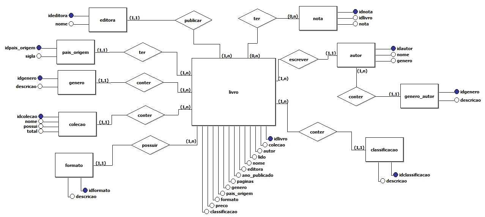
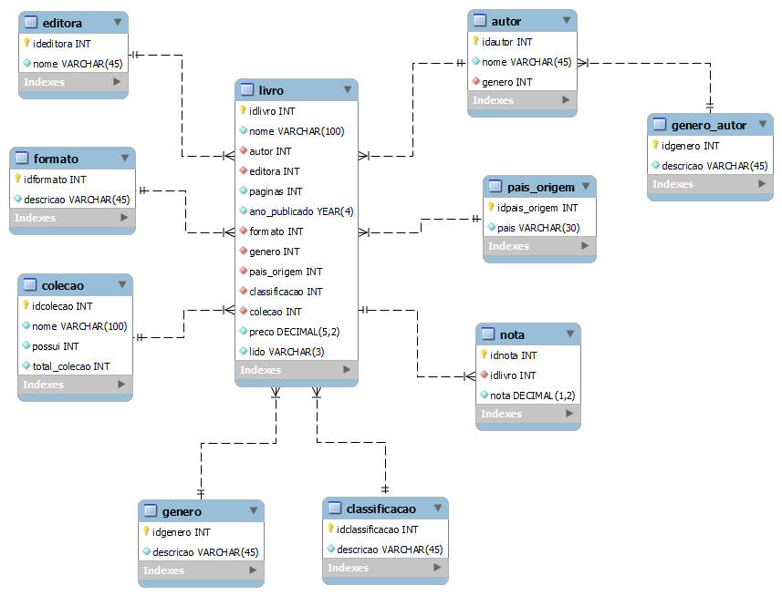

# Biblioteca :green_book:

Instituto Federal de Pernambuco - Campus Paulista  
Disciplina: Banco de Dados I  
Discente: Rebeca Patrícia Albuquerque Wanderley  
Linguagem SQL: **MYSQL**  
Hospedagem: Railway

---
### Objetivo
Catalogação dos meus livros para organização e acompanhamento da coleção.

### Regras de Negócio
Biblioteca pessoal que pode reunir várias informações interessantes sobre o livro. Podendo catalogar as editoras, autores separando por gênero, classificação, formato, coleções para acompanhar se está completa. Assim, garantindo um gerenciamento completo para os livros, retornando dados valiosos para acompanhamento da sua biblioteca. 

#### Dados aceitos
-> Formato
- Físico
- Kindle

-> Classificação
- Livro
- HQ
- Mangá
- Light Novel
- Manhwa

-> Gênero
- Ação
- Ficção científica
- Drama
- Comédia
- Romance
- Aventura
- Mistério
- Suspense
- Fantasia
- Terror
- Ficção
- Poesia
- Distopia
- Conto
- Acadêmico
- Religioso
- Biografia
- Desenvolvimento Pessoal
- Lgbt
- Literatura Infantil
- Crônica 

---
## Modelo Conceitual 

---
## Modelo Relacional 

